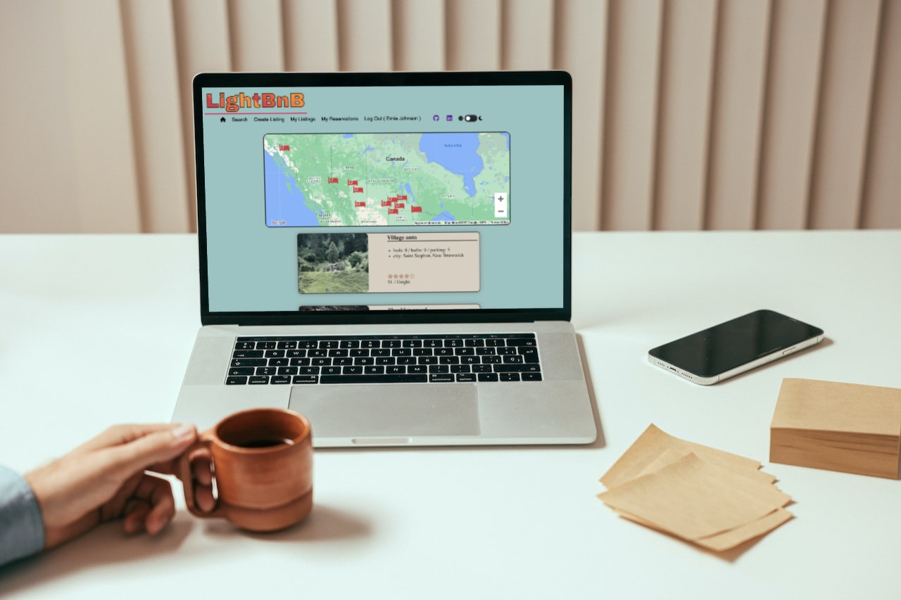

# LightBnB

LightBnB is an "AirBnB" type clone for <a href="www.lighthouselabs.ca">LightHouseLabs.ca</a> students to work on SQL interactions via Ajax on a client-server application build. 

LightBnB clones the very, very basic function of AirBnB where we have a pre-build database of property listings across Canada on the 'backend' of the project, and our web application front end allows for searching of these properties only.  No user accounts, reservation scheduling, etc., is implemented but could be relatively easily.

  

--- 
## Contents...  
1. [Features](#features)
2. [Extra Features](#extra-features)
3. [Future Plans](#future-plans)
4. [Quick Start](#quick-start)
5. [Detailed Operation](#detailed-operation)
6. [Known Bugs](#known-bugs)
7. [Attributions](#attributions)
8. [Updates](#updates)
--- 
## Features...  

- Mobile & desktop friendly.
  - mobile view under 1024 pixels wide
  - footer adjustment under 550 pixels wide   
- Slide open 'tweet box'.
- Slide open/closed error messages.  
[( back to top 🔺)](#lightbnb)
---
## Extra Features...
#### general extras
  - show a "missing" (tent) image if URL is broken or otherwise not returning a valid image item (checks via async call)
  - cleanup nav bar
  - added tooltips on various items
  - add "no listings found" message where appropriate
  - add confirmation modal to 'create listing' option  
 
#### converted ratings to stars (out of 5)
   - hover on stars to see exact rating via tool tips  

#### google maps integration:
  - city level display only as database has ficticious street addresses
  - custom place markers
  - left clickable markers perform database search on city
  - add style to google maps "info window"  

#### style tweaks:
  - add scroll animation (fade in on scroll)
  - box shadow implementation
  - property listings are subdued to nearly grey scale until mouse-over
  - add project title with css gradient animation
  - add light/dark mode toggle (persistent with local storage)

[( back to top 🔺)](#lightbnb)
--- 
## Future Plans...
- allow sorting of any displayed results
- dark mode styling on the map
- tweak pricing to have proper 2 decimals
- new listings go live immediately
- restyle "submit" form button
- restyle "cancel" link on forms
- style entire project for responsive design: mobile to desktop  
[( back to top 🔺)](#lightbnb)
--- 
## Quick Start...  
- loreum ipsum  
[( back to top 🔺)](#lightbnb)

--- 
## Detailed Operation...  
- Clone the github repository to your computer, and follow the instructions above in Quick Start to get to where you can run Tweeter on your computer. 

- From the main window, you can experiment with a few built in sample tweets, or start creating your own by clicking the double down chevrons in the top right to open the tweet message form.  We've incorporated extra features such as "like", "retweet" and "report" this tweet, along with tweet generators from the ICanHazDadJoke API and just a few random ones in our built in database. 

- Clicking the smiley face icon gets you a "Dad Joke", while the shuffle arrows pull a random quote from our internal database.  The numbers represent the characters remaining in your tweet message.

- A tweet must be less than 140 characters, and of course, greater than zero characters!

- If "liking" tweets, you can quickly view your favorites, by clicking the heart icon under your avatar image.  Click it again to return to the view of all tweets.

- We've determined that 10 tweets loaded at a time is plenty.  So if you've got more, scroll down and click the "more" link.  A badge icon shows you how many more older tweets remain to be viewed.

- Tweeter is also built to support both 'desktop' and 'mobile' devices.  Down scaling your window will cause Tweeter to adjust for a more suitable display.   
  
- Of course, we can't forget about everyone's favorite 'must-have' feature - dark mode! Just click the switch to toggle.  
Bonus: favorite state is preserved in localStorage.  
  
[( back to top 🔺)](#lightbnb)
--- 
## Known Bugs...
- Scroll bar is forced 'always' on' to prevent page shift
[( back to top 🔺)](#lightbnb)
---
## Attributions...
- [conColors](https://github.com/ej8899/conColors) (misc. functions)
- [conColors](https://github.com/ej8899/conColors) (misc. style sheets)
- FontAwesome
- Google Fonts, Google Maps API
- Ajax
- Node.js
- JQuery  
[( back to top 🔺)](#lightbnb)
---  
## Updates...
- Get the latest of our version of LightBnB on [Github here](https://github.com/ej8899/lightbnb)!  
[( back to top 🔺)](#lightbnb)
---

