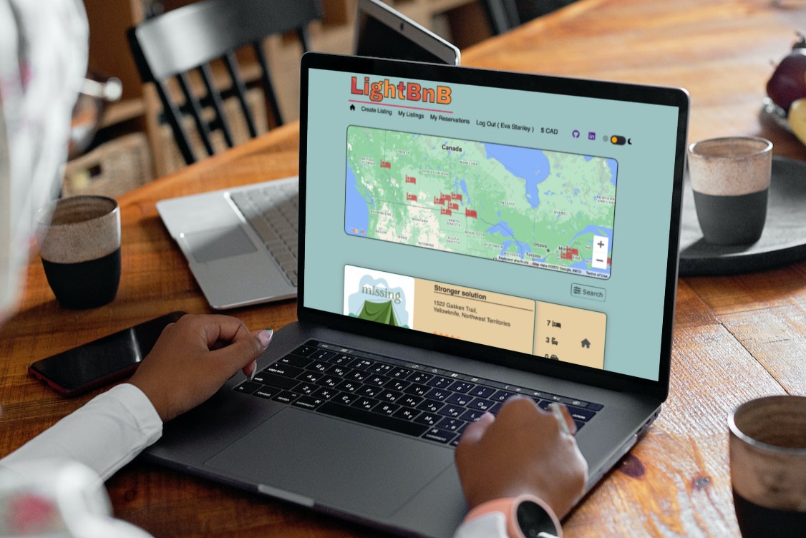

# LightBnB

LightBnB is an "AirBnB" type clone for <a href="www.lighthouselabs.ca">LightHouseLabs.ca</a> students to work on SQL interactions via Ajax on a client-server application build. 

LightBnB clones the very, very basic function of AirBnB where we have a pre-build database of property listings across Canada on the 'backend' of the project, and our web application front end allows for searching of these properties only.  No user accounts, reservation scheduling, etc., is implemented but could be relatively easily.


  

--- 
## Contents...  
1. [Features](#features)
2. [Extra Features](#extra-features)
3. [Future Plans](#future-plans)
4. [Quick Start](#quick-start)
5. [Detailed Operation](#detailed-operation)
6. [Known Bugs](#known-bugs)
7. [Attributions](#attributions)
8. [Updates](#updates)
--- 
## Features...  

- AirBnB type basic clone to use for learning SQL queries on a Postgres database.
- Basic features developed include a quick view of "My Listings", "My Reservations" and "listings" in general.
(requires logged in user with listings or reservations existing in database)
- Create Listing to add property listings to the database.
- Detailed search for city, minimum cost, maximum cost and minimum rating.  All search options are optional.  
[( back to top 🔺)](#lightbnb)

---
## Extra Features...
#### General Extras:
  - show a "missing" (tent) image if URL is broken or otherwise not returning a valid image item (checks via async call)
  - cleanup nav bar
  - added tooltips on various items
  - add "no listings found" message where appropriate
  - add currency selection modal (CAD, USD, MXN supported)
  - add average cost per night db query (result) in search modal
  - add confirmation modal to 'create listing' option  

#### Database Extras:
   - obtain province totals for search window
   - obtain city totals for mapping
   - obtain total listings per price range ($50 increments) for search window
   - obtain average cost per night for search window
 
#### Converted Ratings to Stars:
   - use full, empty & half stars for out of 5 rating
   - hover on stars to see exact rating via tool tips  

#### Google Maps Integration:
  - city level display only as database has ficticious street addresses
  - unknown city info is pulled from google api, and optimized in a local cache to save future fetch costs
  - customized place markers
  - left clickable markers perform database search on city
  - add style to google maps "info window"  

#### Style Tweaks:
  - add scroll animation (fade in on scroll)
  - box shadow implementation
  - property listings are subdued to nearly grey scale until mouse-over
  - add project title with css gradient animation
  - animated 'back to top' floater button
  - add light/dark mode toggle (persistent with local storage)  
  [( back to top 🔺)](#lightbnb)

--- 
## Future Plans...
- allow additional sorting of any displayed results
- dark mode styling on the map
- new listings go live immediately
- grab city 'about' and photo from google API or other web scraping
  (just have to monitor costing for this)
- style entire project for responsive design: mobile to desktop  
[( back to top 🔺)](#lightbnb)
--- 
## Quick Start...  
- you'll need the Postgress DB installed along with some seed data - details on the seed data can be located here: https://flex-web.compass.lighthouselabs.ca/workbooks/flex-m05w12/activities/765?journey_step=42&workbook=16 
- install any dependencies: ```npm install```
- ```npm run local``` to start the server
- point your browser to ```localhost:3000```  
[( back to top 🔺)](#lightbnb)

--- 
## Detailed Operation...  
- Clone the github repository to your computer, and follow the instructions above in Quick Start to get to where you can run LightBnB on your computer. 

- A suggested test user account is:
``` 
Austin Beck
email: makaylahahn@ymail.com
password: password
```  
- Using the above account gets you access to all required features and, assuming the seed data installed, gets you some sample listings, owner listings and reservations under this account.


- From the main window, you select any of the nav bar items, or move about the map and click a city to search there.  Alternatively, you can click or tap the seach button to the bottom right of the map and select search criteria.  Mouse over a property listeing to pop out the details window to view number of beds, baths and parking spaces.


- When in the search window, all shown items are optional searches.  You can drop the province list to search on province, or type a city name (or part of a city name).  Additionaly, you can use the range slider to select a price range to search on and a minimum listing rating.  Finally, a toggle lets you choose to display your search priced low to high, or alternatively, high to low. The bar graph on the price range selection shows the number of listings in each $50 price range, from $1 to $1000. 


- If you need to view listings in a different currency, we currently offer Canadian, US, EUR, BZD and MXN exchanges.  Note this feature is not fully developed through the application yet and incorporated for proof of concept only. 
  
[( back to top 🔺)](#lightbnb)
--- 
## Known Bugs...
- Map error - Richmond exists in both BC and NS. Searches in NS will show map pins in BC unfortunately. This is a quirk in my mapping code and not related to our SQL search or database information.
- Vertical scroll bar is forced 'always' on' to prevent page shifts when data exceeds bottom of viewable space.  
- This application has been tested on Windows 11 via WSL, Ubuntu Linux 20.04, and MacOS 16 Ventura. All platforms tested with Chrome and Firefox browsers. Please report any bugs found!  
[( back to top 🔺)](#lightbnb)
---
## Attributions...
- [conColors](https://github.com/ej8899/conColors) (misc. functions)
- [conColors](https://github.com/ej8899/conColors) (misc. CSS for dark mode template)
- FontAwesome
- Google Fonts, Google Maps API
- Ajax
- Node.js
- JQuery  
[( back to top 🔺)](#lightbnb)
---  
## Updates...
- Get the latest of our version of LightBnB on [Github here](https://github.com/ej8899/lightbnb)!      
[( back to top 🔺)](#lightbnb)
---


